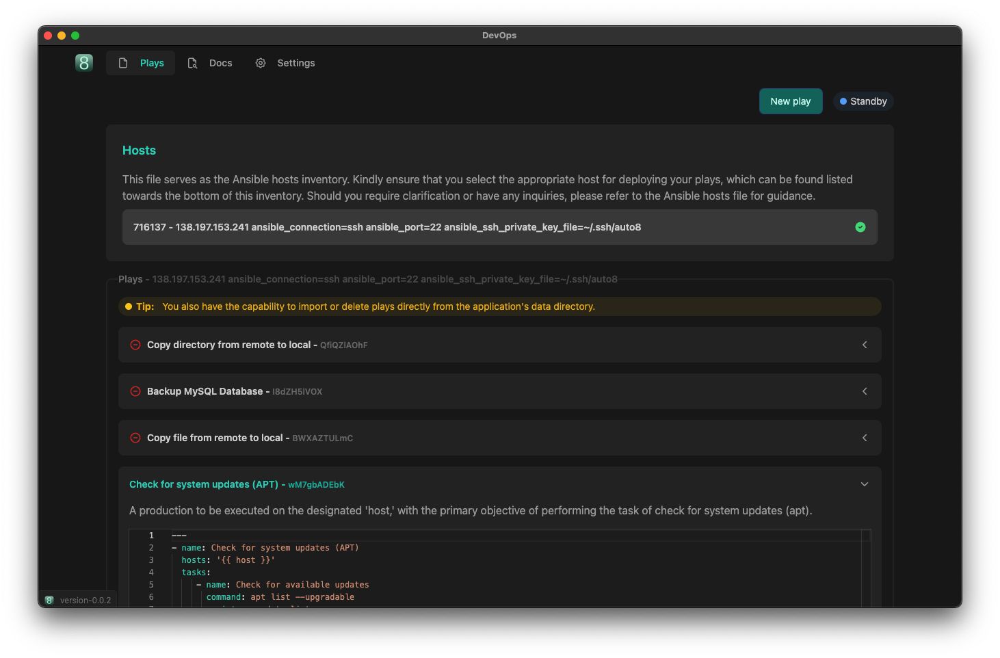

<p align="center">

</p>

### About Auto8 DevOps
Auto8 DevOps is a robust solution dedicated to streamlining and
automating DevOps workflows. Our mission is to simplify complex
processes and enhance productivity by automating tedious tasks
associated with server management, software installation,
backups, and database operations.

<p align="center">

</p>

#### MacOS Release Process

Auto8 DevOps release process.

1. Add missing certificates to the `./builds` folder:
   -  Auto8PPN.provisionprofile
   -  CertificateSigningRequest.certSigningRequest
   -  developerID_application.cer
2. Make sure the certificate are valid by running `npm run build:mac`
   -  If all goes well this will not throw any error o/w proceed with caution
      and follow the error stack.
3. Update package.json with correct `version`
4. Perform the following set of command:

   ```
   npm run clean
   npm run build:mac

   # ONE TIME command
   xcrun notarytool store-credentials --apple-id "XXX@gmail.com" --team-id "XXX"

   xcrun notarytool submit XXX.zip --keychain-profile "devops.auto8.app" --wait
   ```
